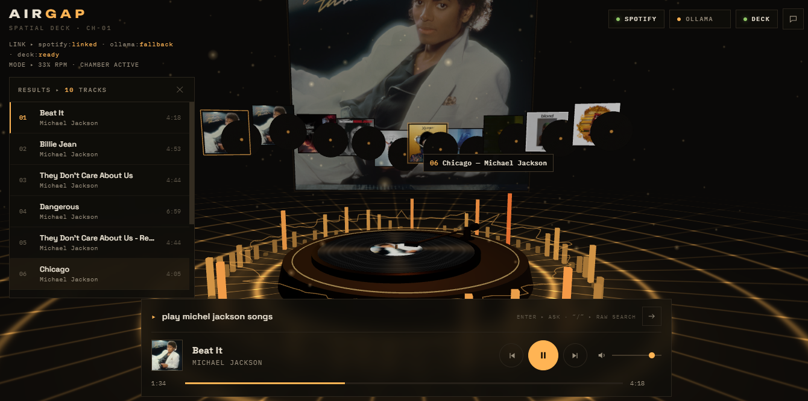

# AIRGAP

> a spatial music deck where you don't search for music — you tell it what you want to hear.

[ **LIVE DECK →**](https://airgap-b4hs.onrender.com/)



---

## THE IDEA

AirGap turns music discovery into a space.

Instead of navigating a conventional music player, you can describe what you want to hear and let the deck translate that intent into music.

Search. Ask. Play.

No playlists required.

---

## INSIDE THE DECK

- 🎧 Natural-language music requests
- 🎧 Spotify search and playback
- 🎧 Spatial album-art interface
- 🎧 Conversational music discovery
- 🎧 Local AI fallback through Ollama
- 🎧 Direct playback controls
- 🎧 Real-time track results

---

## HOW IT WORKS

```text
        YOUR REQUEST
             ▼
         AIRGAP UI   
             ▼
       MUSIC INTENT
        ┌────┴────┐
        ▼         ▼
     Spotify    Ollama
        └────┬────┘
             ▼
       TRACK RESULTS
             ▼
        PLAYBACK DECK
